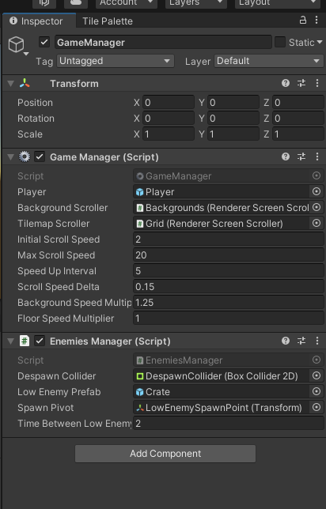
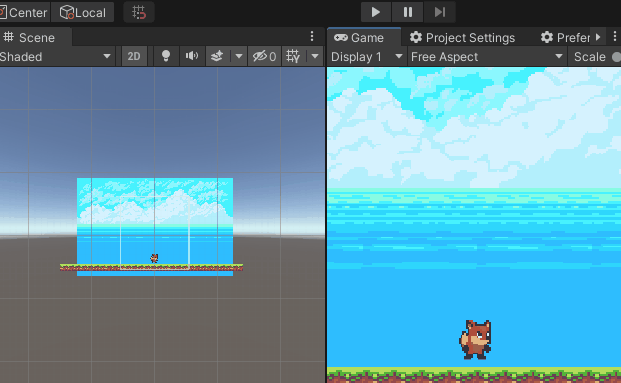
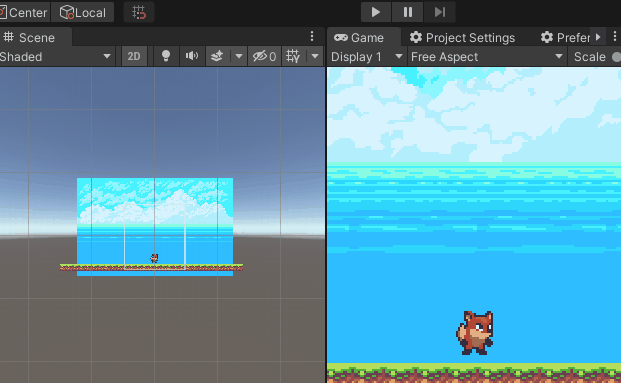
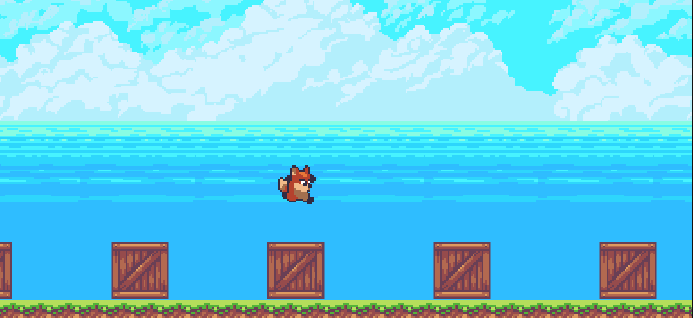
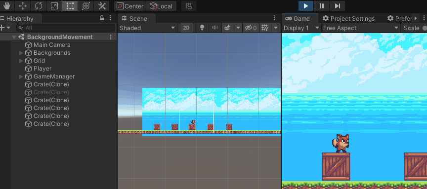

## 1. Scroll con movimiento del fondo. El personaje salta sobre objetos que aparecen en la escena.

Esta tarea de ha realizado en la escena [BackgroundMovement.unity](Assets/Scenes/BackgroundMovement.unity).

Se ha utilizado [RendererScreenScroller.cs](Assets/Scripts/BackgroundMovement/RendererScreenScroller.cs) para replicar un renderer (tilemap renderer o sprite renderer) para poder mover el fondo indefinidamente.

En este caso el script [GameManager.cs](Assets/Scripts/BackgroundMovement/GameManager.cs) establece las siguientes reglas:

- El jugador es empujado continuamente hacia la izquierda 
- Se mueve el fondo y el suelo hacia la izquierda en la misma proporción
- Se hace spawn de objetos estáticos que hay que saltar ([EnemiesManager.cs](Assets/Scripts/BackgroundMovement/EnemiesManager.cs))
- Se incrementa la velocidad con el paso del tiempo 

Se ha usado un sistema de pooling para los enemigos. Ver [GameObjectPool.cs](Assets/Scripts/BackgroundMovement/GameObjectPool.cs). Cuando los enemigos traspasan el despawn collider (OnTriggerExit) se recogen y devuelven a pool.

Además de esto, se ha puesto un sistema de colliders en los bordes de la cámara, para que el jugador sólo pueda estar en la zona visible. ver [CameraLimits.cs](Assets/Scripts/CameraLimits.cs)

## 2. Scroll con movimiento del personaje. El fondo se repite hasta que pare el juego.

Esta tarea de ha realizado en la escena [CameraMovement.unity](Assets/Scenes/CameraMovement.unity).

Se ha utilizado [RendererScreen.cs](Assets/Scripts/CameraMovementScene/RendererScreen.cs) que es similar al anterior usado pero sin scroll automático.

Esta vez se mueve la cámara siguiendo al player usando el script [GameObjectFollower.cs](Assets/Scripts/CameraMovementScene/GameObjectFollower.cs) que tiene un funcionamiento similar a poner la cámara como hija del player, pero con más control sobre que axis queremos que siga.

## 3. Fondo con efecto parallax. El efecto empieza cuando el jugador empieza a moverse, esto se debe comunicar mediante eventos.

Esta tarea de ha realizado en la escena [CameraMovement.unity](Assets/Scenes/CameraMovement.unity).

Se ha utilizado [RendererScreen.cs](Assets/Scripts/CameraMovementScene/RendererScreen.cs) y [GameObjectMovement.cs](Assets/Scripts/ParalaxMovementScene/GameObjectMovement.cs), para conseguir un efecto similar al de la primera tarea pero separando responsabilidades entre scripts.

[ParalaxManager.cs](Assets/Scripts/ParalaxMovementScene/ParalaxManager.cs) se encaga de poner un scroll determinado a las dos capas que hay: foreground y background. De esta manera le ponemos más velocidad al foreground y hacemos el sistema de paralaje. 

En este caso la cámara sigue al player de la misma manera que en la tarea anterior.

## 4. Utilizar la técnica de pool de objetos para ir creando elementos en el juego sobre los que debe saltar el jugador evitándolos o para adquirir puntos si salta sobre ellos.

Se ha utilizado [EnemiesManager.cs](Assets/Scripts/BackgroundMovement/EnemiesManager.cs) en la primera escena para demostrar su uso.

